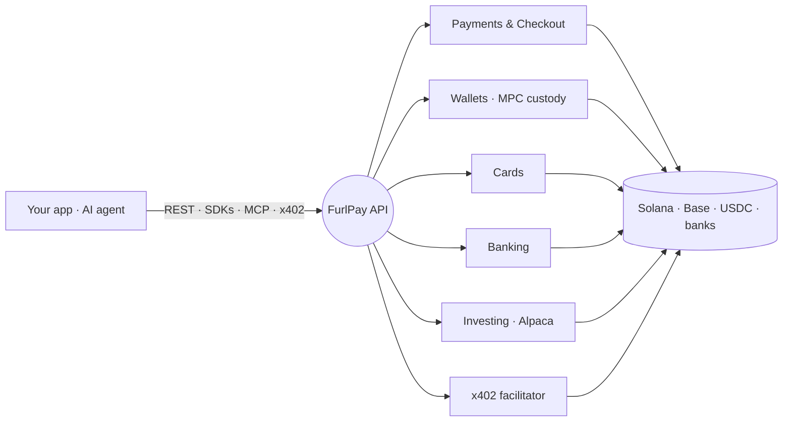

<div align="center">


# The open-source financial OS for the agentic internet

**Stablecoin payments · global banking · virtual cards · fractional investing — plus [x402](https://furlpay.com/docs/payments/agentic-x402) rails so AI agents can pay for what they use. One API, four SDKs, MIT-licensed.**

[**Get API keys →**](https://furlpay.com/signup) · [Docs](https://furlpay.com/docs) · [Pricing](https://furlpay.com/pricing) · [Book a demo](https://furlpay.com/talk-to-us) · [API Spec](https://github.com/FurlPay/furlpay-openapi)

**Stack**


**Live on registries**


</div>

---

## Why FurlPay

The **whole stack, open source** — one developer platform that combines stablecoin payments, banking, cards, and investing *and* is built for AI agents to pay natively over x402. The combination below is what makes FurlPay different:

| What you get | |
|---|:--:|
| **Open source (MIT)** — inspect & self-host the public surface | ✅ |
| **Full financial OS** — payments + banking + cards + investing in one API | ✅ |
| **Agent-native x402** — pay-per-call APIs, agent spend budgets, Know-Your-Agent | ✅ |
| **Fractional investing built in** — stocks & ETFs via Alpaca | ✅ |
| **First-class AI tools** — LangChain, LlamaIndex & MCP out of the box | ✅ |
| **Four SDKs, one surface** — Node · Python · Go · Rust | ✅ |

<sub>FurlPay builds *on* the x402 open standard (Linux Foundation; Google, Visa, Circle, Anthropic, Vercel). See the [docs](https://furlpay.com/docs).</sub>

## Quickstart — pick your path

**Accept stablecoins & use the full API** — `npm i @furlpay/furlpay-node`

```ts
import { Furlpay } from "@furlpay/furlpay-node";
const furlpay = new Furlpay({ apiKey: process.env.FURLPAY_API_KEY! });

const wallet = await furlpay.wallets.retrieve();                 // MPC smart-account balances
const order  = await furlpay.investing.createOrder({             // fractional stock, funded in USDC
  symbol: "AAPL", side: "buy", notional: 100,
});
```

**Sell an API to AI agents over x402** — `npm i @furlpay/x402`

```ts
import { withX402 } from "@furlpay/x402";

// Unpaid requests get HTTP 402; paid ones run the handler. No API keys, no accounts.
export const GET = withX402(
  async () => Response.json({ data: "premium market signal" }),
  { payTo: "0xYourAddress", network: "base", amount: "10000", description: "Premium data" }
);
```

**Give your AI agent a wallet** — `pip install furlpay-langchain` (or `furlpay-llamaindex`)

```python
from furlpay_langchain import get_furlpay_tools

tools = get_furlpay_tools()   # 12 tools: pay, invest, transfer, swap, and pay-per-call over x402
agent = create_tool_calling_agent(llm, tools, prompt)   # your agent can now move money — within a budget
```

**Drive FurlPay from Claude / Cursor** — add the MCP server to your client config:

```json
{ "mcpServers": { "furlpay": {
  "command": "npx", "args": ["-y", "@furlpay/mcp-server"],
  "env": { "FURLPAY_API_KEY": "fp_live_sk_..." }
} } }
```

> New here? **[furlpay-examples](https://github.com/FurlPay/furlpay-examples)** is clone-and-run for Next.js, Express, FastAPI, Go, Rust, MCP & x402 — the fastest path to a first payment.

## What you can build

| Capability | What it does |
|---|---|
|  | Hosted checkout & payment intents, settled in USDC — instant, no chargebacks |
|  | MPC / Safe smart accounts, passkeys, multi-chain balances |
|  | Wallet-to-wallet, on-chain, batch; cheapest cross-chain stablecoin routing |
|  | Virtual + physical card issuing, limits, freeze, spend controls |
|  | Multi-currency accounts — IBAN / ACH / SEPA / SWIFT in and out |
|  | Fractional stocks & ETFs (via Alpaca), portfolios, auto-invest (DCA) |
|  | Pay-per-call APIs, agent spend budgets, Know-Your-Agent |
|  | KYC / AML / Travel Rule, jurisdiction & tier engine |
|  | Signed events (`t=<unix>,v1=<hmac-sha256-hex>`, 5-min replay window) |

## Architecture



## SDKs — one API, four languages

Same client surface and the same webhook signature scheme everywhere.

| Language | Install | Repo |
|---|---|---|
| Node.js / TypeScript | `npm i @furlpay/furlpay-node` | [furlpay-node](https://github.com/FurlPay/furlpay-node) |
| Python | `pip install furlpay` | [furlpay-python](https://github.com/FurlPay/furlpay-python) |
| Go | `go get github.com/furlpay/furlpay-go` | [furlpay-go](https://github.com/FurlPay/furlpay-go) |
| Rust | `cargo add furlpay` | [furlpay-rust](https://github.com/FurlPay/furlpay-rust) |

## Build with Furlpay

| Repo | What it is |
|---|---|
| [furlpay-examples](https://github.com/FurlPay/furlpay-examples) | ⭐ Runnable examples for every stack — the fastest path to a first payment |
| [furlpay-cli](https://github.com/FurlPay/furlpay-cli) | `stripe-cli` for stablecoins — webhook forwarding & test events (`@furlpay/cli`) |
| [furlpay-elements](https://github.com/FurlPay/furlpay-elements) | Embeddable React checkout components (`@furlpay/elements`) |
| [furlpay-account-kit](https://github.com/FurlPay/furlpay-account-kit) | Safe/ERC-4337 smart accounts, paymaster, time-locked escrow (`@furlpay/account-kit`) |
| [furlpay-x402](https://github.com/FurlPay/furlpay-x402) | x402 facilitator + payment middleware — the first Solana-native x402 facilitator |
| [x402-guard](https://github.com/FurlPay/x402-guard) | x402 hardening middleware — nonce, replay & duplicate-settlement protection, zero deps (`@furlpay/x402-guard`) |
| [furlpay-extension](https://github.com/FurlPay/furlpay-extension) | MV3 browser extension (open for security audit) |
| [furlpay-openapi](https://github.com/FurlPay/furlpay-openapi) | OpenAPI 3.1 spec — generate SDKs in any language |
| [furlpay-solana-actions-template](https://github.com/FurlPay/furlpay-solana-actions-template) | Starter: Solana Actions & Blinks checkout links |

## AI agents — payment rails for the agentic internet

Give an AI agent a wallet: check balances, create checkouts, move stablecoins, invest, and **pay for x402-metered APIs within a spending budget**.

| Repo | What it is |
|---|---|
| [furlpay-mcp-server](https://github.com/FurlPay/furlpay-mcp-server) | MCP server — drive Furlpay from Claude, Cursor & AI agents (`@furlpay/mcp-server`) |
| [furlpay-langchain](https://github.com/FurlPay/furlpay-langchain) | Furlpay tools for **LangChain** — 12 agent tools incl. autonomous x402 payments (`pip install furlpay-langchain`) |
| [furlpay-llamaindex](https://github.com/FurlPay/furlpay-llamaindex) | Furlpay tool spec for **LlamaIndex** — same agent toolset (`pip install furlpay-llamaindex`) |
| [furlpay-openbb-plugin](https://github.com/FurlPay/furlpay-openbb-plugin) | The **execution layer** for OpenBB Workspace — trade, DCA & settle in stablecoins |

## Data & investing

| Repo | What it is |
|---|---|
| [furlpay-market-data](https://github.com/FurlPay/furlpay-market-data) | Real-time stock/ETF quotes & bars — Alpha Vantage + Nasdaq aggregator with demo fallback (`npm i @furlpay/market-data`) |
| [furlpay-auto-invest](https://github.com/FurlPay/furlpay-auto-invest) | Automated dollar-cost averaging — schedule recurring USDC-funded buys (`npm i @furlpay/auto-invest`) |

## Security & trust

Payments infrastructure is only as good as its security posture.

- **Published, provenance-tracked packages** across npm, PyPI & crates.io — no unsigned releases.
- **[x402-guard](https://github.com/FurlPay/x402-guard)** implements defenses for every known x402 facilitator flaw (request-binding, nonce linearization, allowance reserve-commit, settlement capacity limits, adaptive pricing) — the hardening layer facilitators skip.
- **Private core** — custody engines, fraud models, and HSM signing policies stay in a private monorepo; public packages are the supported, auditable surface.
- **Responsible disclosure** — [hello@furlpay.com](mailto:hello@furlpay.com); see each repo's `SECURITY.md`. Please don't open public issues for vulnerabilities.

## Contribute

We're building payment rails for the agentic internet, and the hard problems are open:
agent spend mandates, Know-Your-Agent trust signals, idempotency & retry semantics,
and SDK parity across languages.

- **[Open issues across the org](https://github.com/search?q=org%3AFurlPay+state%3Aopen&type=issues)** — look for `good first issue` and `help wanted`
- **`agentic-payments` label** — the frontier problems (x402, spend mandates, KYA)
- **[Contributing guide](https://github.com/FurlPay/.github/blob/main/CONTRIBUTING.md)**

## Community

- **Questions & integration help** — GitHub Discussions, enabled on every repo
- **Security reports** — [hello@furlpay.com](mailto:hello@furlpay.com) (see each repo's SECURITY.md)
- **Show what you built** — Discussions "Show and tell"

---

<div align="center">

### Ready to move money — for humans and agents?

[**Get API keys →**](https://furlpay.com/signup) · [Read the docs](https://furlpay.com/docs) · [Book a demo](https://furlpay.com/talk-to-us)

<sub>Open source (MIT). Core custody, fraud models & HSM signing stay private; public packages are the supported surface.</sub>

</div>
